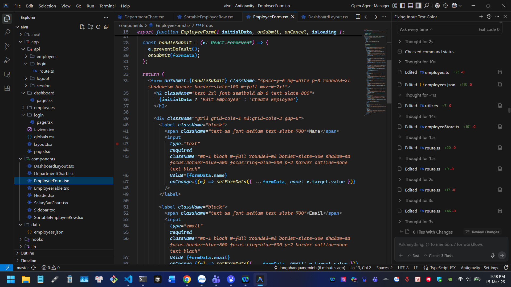
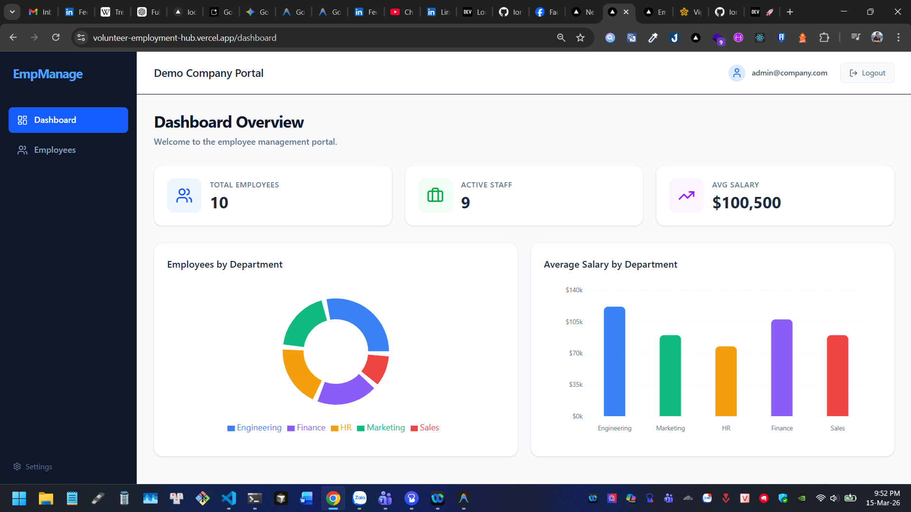

# Employee Management System Demo

A modern, full-stack Employee Management System built with **Next.js 16**, **React 19**, and **Tailwind CSS**. This project demonstrates AI-assisted development using Google Antigravity, featuring a complete CRUD interface, secure authentication, and interactive data analytics.

🚀 **Live Demo:** [https://volunteer-employment-hub.vercel.app](https://volunteer-employment-hub.vercel.app)




---

## ✨ Features

- **🔐 Secure Authentication:** Admin login with session management via cookies and Next.js Middleware.
- **📊 Interactive Dashboard:** Real-time analytics using `Recharts`, including:
  - Global stats (Total Employees, Active Staff, Average Salary).
  - Employee distribution by department (Pie Chart).
  - Average salary comparison (Bar Chart).
- **📋 Employee CRUD:** Complete system to create, read, update, and delete employee records.
- **↕️ Drag & Drop Reordering:** Interactive table rows powered by `@dnd-kit` for intuitive sorting.
- **🔍 Advanced List Tools:** Instant client-side searching and filtering by department.
- **📱 Fully Responsive:** Optimized for Mobile, Tablet (iPad), and Desktop with a slide-out mobile sidebar.
- **💾 Local Data Store:** Persists data to a local `JSON` file with an in-memory fallback system.

---

## 🛠️ Tech Stack

- **Framework:** [Next.js 16 (App Router)](https://nextjs.org/)
- **UI & Logic:** [React 19](https://react.dev/), [TypeScript](https://www.typescriptlang.org/)
- **Styling:** [Tailwind CSS 4](https://tailwindcss.com/)
- **Icons:** [Lucide React](https://lucide.dev/)
- **Charts:** [Recharts](https://recharts.org/)
- **Drag & Drop:** [@dnd-kit](https://dndkit.com/)
- **Animations:** [Framer Motion](https://www.framer.com/motion/)

---

## 📂 Project Structure

- **`/app`**: Next.js App Router pages and API routes.
- **`/components`**: Reusable UI components (Table, Form, Charts, Sidebar, etc.).
- **`/hooks`**: Custom React hooks for Auth and Employee data management.
- **`/lib`**: Data layer (`employeeStore`) and utility functions.
- **`/data`**: Local JSON storage for employee records.
- **`/types`**: TypeScript interface definitions.

---

## 📖 Related Documents

This project was guided by structured AI prompts and includes detailed documentation for further development:

- **[PROMPT.md](./PROMPT.md)**: The original structured prompts used to generate this project.
- **[DEMO_SCRIPT.md](./DEMO_SCRIPT.md)**: A step-by-step 3-minute guide for presenting the application.
- **[IMPROVEMENTS.md](./IMPROVEMENTS.md)**: Roadmap for scaling this to a production-ready enterprise architecture.

---

## 🚀 Getting Started

1.  **Clone and Install:**
    ```bash
    npm install
    ```

2.  **Run Locally:**
    ```bash
    npm run dev
    ```

3.  **Login Credentials:**
    - **Email:** `admin@company.com`
    - **Password:** `admin123`

---

## 🛡️ License

Built by Long Phan (Mike) with ❤️ using **Google Antigravity**.
